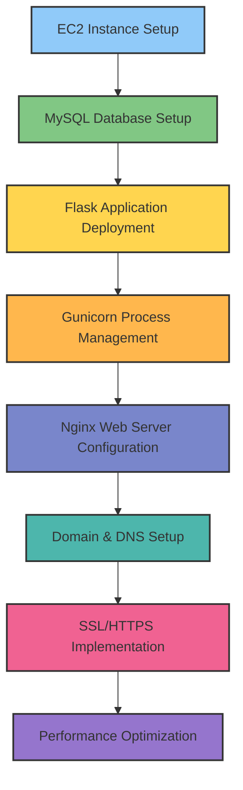

# Complete E-Commerce Application Deployment on AWS EC2

This comprehensive guide documents the process of deploying a Python Flask-based e-commerce application on AWS EC2, with MySQL database, Nginx web server, and HTTPS configuration. It includes all encountered issues and their solutions.

## Table of Contents
1. [Initial Server Setup](#1-initial-server-setup)
2. [MySQL Database Setup](#2-mysql-database-setup)
3. [Application Deployment](#3-application-deployment)
4. [Process Management with systemd](#4-process-management-with-systemd)
5. [Nginx Configuration](#5-nginx-configuration)
6. [DNS Configuration with Route 53](#6-dns-configuration-with-route-53)
7. [SSL/HTTPS Setup with Let's Encrypt](#7-sslhttps-setup-with-lets-encrypt)
8. [Troubleshooting Common Issues](#8-troubleshooting-common-issues)
9. [Performance Tuning](#9-performance-tuning)
10. [Maintenance and Updates](#10-maintenance-and-updates)

## Architecture

### This high-level flowchart shows the main components of your e-commerce application deployment in a simplified, sequential format. The key stages are:

**1. EC2 Instance Setup** - Preparing the server environment

**2. MySQL Database Setup** - Installing and configuring the database

**3. Flask Application Deployment** - Deploying your Python application code

**4. Gunicorn Process Management** - Setting up the WSGI server with systemd

**5. Nginx Web Server Configuration** - Configuring the web server and proxy

**6. Domain & DNS Setup** - Setting up Route 53 and linking your domain

**7. SSL/HTTPS Implementation** - Securing the site with Let's Encrypt

**8. Performance Optimization** - Tuning all components for better performance


---

## 1. Initial Server Setup

### 1.1 Connect to your EC2 instance
```bash
ssh -i path/to/your-key.pem ec2-user@your-ec2-public-ip
```

### 1.2 Update the system
```bash
sudo yum update -y
```

### 1.3 Install required packages
```bash
sudo yum install -y git python3 python3-pip python3-devel mysql-devel gcc nginx
```

### 1.4 Configure the firewall (optional)
```bash
sudo yum install -y firewalld
sudo systemctl start firewalld
sudo systemctl enable firewalld
sudo firewall-cmd --permanent --add-service=http
sudo firewall-cmd --permanent --add-service=https
sudo firewall-cmd --reload
```

## 2. MySQL Database Setup

### 2.1 Install MySQL server (MariaDB)
```bash
sudo yum install -y mysql-server
sudo systemctl start mysqld
sudo systemctl enable mysqld
```

### 2.2 Secure MySQL installation
```bash
sudo mysql_secure_installation
```
Follow the prompts to set a root password, remove anonymous users, disallow root login remotely, etc.

### 2.3 Create the database and configure user
```bash
mysql -u root -p
```

Once logged into MySQL, run:
```sql
CREATE DATABASE ecommerce;
CREATE USER 'root'@'localhost' IDENTIFIED BY 'admin@1234';
GRANT ALL PRIVILEGES ON ecommerce.* TO 'root'@'localhost';
FLUSH PRIVILEGES;
EXIT;
```

If you need to update the root password later (in case of authentication issues):
```sql
ALTER USER 'root'@'localhost' IDENTIFIED BY 'admin@1234';
FLUSH PRIVILEGES;
```

### 2.4 Tune MySQL for better performance
```bash
sudo nano /etc/my.cnf
```

Add under the `[mysqld]` section (create it if it doesn't exist):
```
max_allowed_packet=16M
wait_timeout=28800
interactive_timeout=28800
max_connections=150
```

Restart MySQL:
```bash
sudo systemctl restart mysqld
```

## 3. Application Deployment

### 3.1 Clone the repository
```bash
cd ~
git clone https://github.com/SubbuTechOps/python-ecommerce-ec2-mysql-nginx-https.git
cd python-app-docker-compose
```

### 3.2 Create and activate a virtual environment
```bash
cd backend
python3 -m venv venv
source venv/bin/activate
```

### 3.3 Install requirements
```bash
pip install -r requirements.txt
pip install gunicorn
```

### 3.4 Configure environment variables
Create a `.env` file in the backend directory:
```bash
cat > .env << 'EOF'
DB_HOST=localhost
DB_USER=root
DB_PASSWORD=admin@1234
DB_NAME=ecommerce

SECRET_KEY=f89d3h2f98d32f928d32f98h23f98h239f8h239f8h23
FLASK_DEBUG=False
PORT=5000
SESSION_FILE_DIR=/tmp/flask_sessions
FRONTEND_PATH=/home/ec2-user/python-app-docker-compose/frontend
EOF
```

### 3.5 Test running the application
```bash
export FRONTEND_PATH=/home/ec2-user/python-app-docker-compose/frontend
gunicorn --bind 0.0.0.0:8000 wsgi:app
```

Press Ctrl+C to stop after verifying it works.

## 4. Process Management with systemd

### 4.1 Create a systemd service file
```bash
sudo nano /etc/systemd/system/ecommerce.service
```

Add the following configuration:
```ini
[Unit]
Description=Gunicorn instance to serve ecommerce application
After=network.target

[Service]
User=ec2-user
Group=ec2-user
WorkingDirectory=/home/ec2-user/python-app-docker-compose/backend
Environment="FRONTEND_PATH=/home/ec2-user/python-app-docker-compose/frontend"
ExecStart=/bin/bash -c '/home/ec2-user/myapp/venv/bin/gunicorn --workers 3 --bind 127.0.0.1:8000 wsgi:app'
Restart=always

[Install]
WantedBy=multi-user.target
```

**Note**: Adjust the path to gunicorn based on your virtual environment location.

### 4.2 Enable and start the service
```bash
sudo systemctl daemon-reload
sudo systemctl start ecommerce
sudo systemctl enable ecommerce
```

### 4.3 Check the service status
```bash
sudo systemctl status ecommerce
```

## 5. Nginx Configuration

### 5.1 Set proper file permissions for frontend files
```bash
sudo chmod -R 755 /home/ec2-user/python-app-docker-compose/frontend
sudo chmod 755 /home/ec2-user
sudo chmod 755 /home/ec2-user/python-app-docker-compose
```

### 5.2 Configure SELinux context for frontend files
```bash
sudo chcon -Rt httpd_sys_content_t /home/ec2-user/python-app-docker-compose/frontend
```

### 5.3 Create Nginx configuration
```bash
sudo nano /etc/nginx/conf.d/ecommerce.conf
```

Add the following configuration for HTTP:
```nginx
server {
    listen 80;
    server_name sangamsoftsol.com www.sangamsoftsol.com;

    # Serve static files directly
    location / {
        root /home/ec2-user/python-app-docker-compose/frontend;
        index index.html;
        try_files $uri $uri/ /index.html;
    }

    # Proxy API requests to the Flask backend
    location /api/ {
        proxy_pass http://127.0.0.1:8000;
        proxy_set_header Host $host;
        proxy_set_header X-Real-IP $remote_addr;
        proxy_set_header X-Forwarded-For $proxy_add_x_forwarded_for;
        proxy_set_header X-Forwarded-Proto $scheme;
        proxy_set_header Origin $http_origin;
    }

    # Error pages
    error_page 404 /404.html;
    error_page 500 502 503 504 /50x.html;
}
```

### 5.4 Test and start Nginx
```bash
sudo nginx -t
sudo systemctl start nginx
sudo systemctl enable nginx
```

### 5.5 Enable HTTPD to connect to the network (SELinux)
```bash
sudo setsebool -P httpd_can_network_connect on
```

## 6. DNS Configuration with Route 53

### 6.1 Allocate an Elastic IP
1. Go to AWS EC2 Console → Elastic IPs
2. Click "Allocate Elastic IP address"
3. Select "Amazon's pool of IPv4 addresses" and click "Allocate"
4. Select the new Elastic IP, click "Actions" → "Associate Elastic IP address"
5. Select your EC2 instance and click "Associate"

### 6.2 Create a Route 53 Hosted Zone
1. Go to the AWS Route 53 console
2. Click on "Hosted zones" → "Create hosted zone"
3. Enter your domain name (e.g., sangamsoftsol.com)
4. Choose "Public hosted zone" and click "Create"

### 6.3 Add DNS Records
1. Inside your hosted zone, click "Create record"
2. For root domain, keep the default (no subdomain)
3. Choose record type "A - Routes traffic to an IPv4 address"
4. Enter your Elastic IP address
5. Click "Create records"

6. For the www subdomain, click "Create record" again
7. Enter "www" in the Record name field
8. Choose record type "A - Routes traffic to an IPv4 address"
9. Enter the same Elastic IP address
10. Click "Create records"

### 6.4 Update Nameservers at Domain Registrar
1. In your Route 53 hosted zone, note the four nameservers listed
2. Log in to your domain registrar (like GoDaddy)
3. Find the DNS or nameserver settings
4. Update the nameservers to the four AWS Route 53 nameservers
5. Save changes and wait for DNS propagation (may take 24-48 hours)

## 7. SSL/HTTPS Setup with Let's Encrypt

### 7.1 Install Certbot with Podman
```bash
sudo yum install -y podman
sudo mkdir -p /var/www/letsencrypt
sudo podman pull certbot/certbot
```

### 7.2 Configure Nginx for Let's Encrypt Challenge
Edit the Nginx configuration:
```bash
sudo nano /etc/nginx/conf.d/ecommerce.conf
```

Update to include ACME challenge location:
```nginx
server {
    listen 80;
    server_name sangamsoftsol.com www.sangamsoftsol.com;

    location /.well-known/acme-challenge/ {
        root /var/www/letsencrypt;
        default_type "text/plain";
        allow all;
        autoindex on;
        try_files $uri /$1;
    }

    location / {
        root /home/ec2-user/python-app-docker-compose/frontend;
        index index.html;
        try_files $uri $uri/ /index.html;
    }

    location /api/ {
        proxy_pass http://127.0.0.1:8000;
        proxy_set_header Host $host;
        proxy_set_header X-Real-IP $remote_addr;
        proxy_set_header X-Forwarded-For $proxy_add_x_forwarded_for;
        proxy_set_header X-Forwarded-Proto $scheme;
        proxy_set_header Origin $http_origin;
    }
}
```

Restart Nginx:
```bash
sudo systemctl restart nginx
```

### 7.3 Obtain SSL Certificate
Run Certbot to get certificates:
```bash
sudo podman run --rm -it \
  -v /etc/letsencrypt:/etc/letsencrypt:z \
  -v /var/lib/letsencrypt:/var/lib/letsencrypt:z \
  -v /var/www/letsencrypt:/var/www/letsencrypt:z \
  docker.io/certbot/certbot certonly --webroot \
  -w /var/www/letsencrypt \
  -d sangamsoftsol.com -d www.sangamsoftsol.com
```

### 7.4 Update Nginx Configuration for HTTPS
```bash
sudo nano /etc/nginx/conf.d/ecommerce.conf
```

Replace with HTTPS configuration:
```nginx
server {
    listen 80;
    server_name sangamsoftsol.com www.sangamsoftsol.com;
    
    location /.well-known/acme-challenge/ {
        root /var/www/letsencrypt;
        default_type "text/plain";
        allow all;
        autoindex on;
    }
    
    # Redirect all other HTTP traffic to HTTPS
    location / {
        return 301 https://$host$request_uri;
    }
}

server {
    listen 443 ssl;
    server_name sangamsoftsol.com www.sangamsoftsol.com;

    ssl_certificate /etc/letsencrypt/live/sangamsoftsol.com/fullchain.pem;
    ssl_certificate_key /etc/letsencrypt/live/sangamsoftsol.com/privkey.pem;
    
    # SSL parameters
    ssl_protocols TLSv1.2 TLSv1.3;
    ssl_prefer_server_ciphers on;
    ssl_ciphers ECDHE-RSA-AES256-GCM-SHA512:DHE-RSA-AES256-GCM-SHA512:ECDHE-RSA-AES256-GCM-SHA384:DHE-RSA-AES256-GCM-SHA384;
    ssl_session_timeout 1d;
    ssl_session_cache shared:SSL:10m;
    ssl_session_tickets off;

    # Serve static files
    location / {
        root /home/ec2-user/python-app-docker-compose/frontend;
        index index.html;
        try_files $uri $uri/ /index.html;
    }

    # API proxy
    location /api/ {
        proxy_pass http://127.0.0.1:8000;
        proxy_set_header Host $host;
        proxy_set_header X-Real-IP $remote_addr;
        proxy_set_header X-Forwarded-For $proxy_add_x_forwarded_for;
        proxy_set_header X-Forwarded-Proto $scheme;
        proxy_set_header Origin $http_origin;
    }
}
```

Test and restart Nginx:
```bash
sudo nginx -t
sudo systemctl restart nginx
```

### 7.5 Set Up Auto-Renewal
Create a cron job for certificate renewal:
```bash
echo "0 3 * * * root podman run --rm \
-v /etc/letsencrypt:/etc/letsencrypt:z \
-v /var/lib/letsencrypt:/var/lib/letsencrypt:z \
-v /var/www/letsencrypt:/var/www/letsencrypt:z \
docker.io/certbot/certbot renew --quiet && systemctl restart nginx" | sudo tee -a /etc/crontab
```

## 8. Troubleshooting Common Issues

### 8.1 MySQL Connection Issues
If you encounter database connection errors ("Got an error reading communication packets"), modify MySQL configuration:
```bash
sudo nano /etc/my.cnf
```

Ensure these parameters are set in the `[mysqld]` section:
```
max_allowed_packet=16M
wait_timeout=28800
interactive_timeout=28800
max_connections=150
```

Restart MySQL and your application:
```bash
sudo systemctl restart mysqld
sudo systemctl restart ecommerce
```

Reset MySQL connection state:
```bash
mysql -u root -p -e "FLUSH HOSTS;"
```

### 8.2 Nginx Permission Denied Errors
If Nginx can't access frontend files:
```bash
sudo chmod -R 755 /home/ec2-user/python-app-docker-compose/frontend
sudo chmod 755 /home/ec2-user
sudo chmod 755 /home/ec2-user/python-app-docker-compose
sudo chcon -Rt httpd_sys_content_t /home/ec2-user/python-app-docker-compose/frontend
```

### 8.3 SELinux Permission Errors
If Nginx can't connect to your application:
```bash
sudo setsebool -P httpd_can_network_connect on
```

### 8.4 Let's Encrypt Certificate Issues
If Let's Encrypt validation fails, ensure your domain is correctly pointing to your server and that Nginx is properly configured to serve the challenge files.

## 9. Performance Tuning

### 9.1 Gunicorn Workers
For better performance, adjust the number of Gunicorn workers. A good rule is (2 x CPU cores) + 1:
```bash
sudo nano /etc/systemd/system/ecommerce.service
```

Update the ExecStart line:
```
ExecStart=/bin/bash -c '/home/ec2-user/myapp/venv/bin/gunicorn --workers 4 --bind 127.0.0.1:8000 wsgi:app'
```

Reload and restart:
```bash
sudo systemctl daemon-reload
sudo systemctl restart ecommerce
```

### 9.2 Nginx Performance
Add performance optimizations to your Nginx configuration:
```nginx
# In http or server block
client_max_body_size 10M;
gzip on;
gzip_comp_level 5;
gzip_min_length 256;
gzip_proxied any;
gzip_types application/javascript application/json text/css text/plain text/xml;
```

### 9.3 MySQL Performance
```bash
sudo nano /etc/my.cnf
```

Add performance settings (adjust values based on server resources):
```
innodb_buffer_pool_size = 128M
innodb_log_file_size = 32M
key_buffer_size = 32M
```

## 10. Maintenance and Updates

### 10.1 Database Backup
Set up a daily backup for your MySQL database:
```bash
sudo nano /etc/cron.daily/backup-db.sh
```

Add backup script:
```bash
#!/bin/bash
TIMESTAMP=$(date +"%Y%m%d-%H%M%S")
BACKUP_DIR="/home/ec2-user/backups"
mkdir -p $BACKUP_DIR
mysqldump -u root -padmin@1234 ecommerce > $BACKUP_DIR/ecommerce-$TIMESTAMP.sql
find $BACKUP_DIR -name "ecommerce-*.sql" -mtime +7 -delete
```

Make it executable:
```bash
sudo chmod +x /etc/cron.daily/backup-db.sh
```

### 10.2 Application Updates
```bash
cd /home/ec2-user/python-app-docker-compose
git pull
cd backend
source venv/bin/activate
pip install -r requirements.txt
sudo systemctl restart ecommerce
```

### 10.3 SSL Certificate Monitoring
Check SSL certificate expiration:
```bash
sudo certbot certificates
```

Test renewal process:
```bash
sudo podman run --rm -it \
-v /etc/letsencrypt:/etc/letsencrypt:z \
-v /var/lib/letsencrypt:/var/lib/letsencrypt:z \
-v /var/www/letsencrypt:/var/www/letsencrypt:z \
docker.io/certbot/certbot renew --dry-run
```

### 10.4 System Updates
```bash
sudo yum update -y
sudo systemctl restart mysqld nginx ecommerce
```

## Conclusion

Your e-commerce application is now fully deployed with:
- Python Flask backend running with Gunicorn
- MySQL database for data storage
- Nginx as a reverse proxy and static file server
- Route 53 DNS configuration
- HTTPS secured with Let's Encrypt SSL certificate
- Performance optimizations for production use

All common issues have been addressed, and your site is now running securely at https://www.sangamsoftsol.com.
